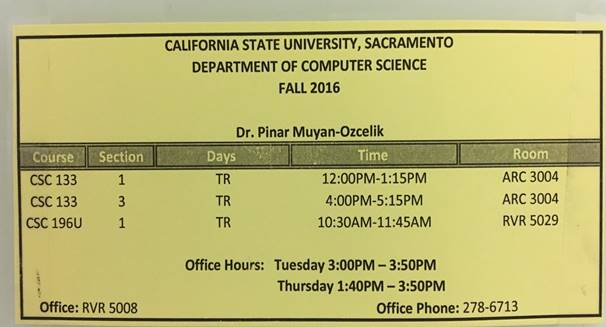

SEAR, Software Engineering for Academic Research, a non-existent
non-profit dedicated to helping aspiring software engineers solve real
world problems

To: Spring 2017 CS131 and CS170 student teams

Request for Proposal

For

A Database System to Generate Faculty Information Cards

Due Date/Time: February 26, 11:59 PM

I.  Introduction

    a.  The CS department must post Faculty Information Cards each
        semester outside the office where they sit. This project is to
        create a system to solve that need. A sample of the card is in
        Appendix A

    b.  Proposals for this project must be received by email in PDF for
        before 11:59 PM at <dale.fletter@csus.edu>.

    c.  Questions regarding this solicitation must be brought up in
        class so all bidders can hear the additional information. No
        emails or personal consultations outside of class will get a
        response.

    d.  A student is expected to put in approximate 6 hours per week
        into the project work for this class. Your proposal must provide
        a total work hour estimate and this rough guide should be used
        both for your estimated effort and for your final summary. You
        must be truthful in your final report since the amount of effort
        above or below your estimate is an important metric for this
        agency.

II. Scope

    a.  There are only two staff members involved; the office
        administrator and a clerk. The information about a faculty
        member should only be changeable by the office administrator.
        The entry of faculty office hours and the viewing of all
        information is allowed for the clerk. The only information that
        should be seen by anyone else (optional) it must be limited to
        the faculty information card itself.

    b.  The system must be capable of printing all of the cards in one
        operation for the initial posting. It must also be capable of
        printing an individual card on request.

    c.  All of the needed database maintenance screens to build and
        maintain the database are part of this project.

    d.  An optional feature is to allow the generation for a new
        semester based on the information from the prior semester and
        keep both in the database.

    e.  Another optional feature is to create a system that can serve
        more than one academic department. Note that each department has
        its own administrator and clerk. Only an administrator can setup
        a clerk. But any administrator can create a new academic
        department and grant authority to the admin or reset the
        password of another admin. But no admin should be able to
        directly see the data of a different department.

    f.  The scope of work will depend upon your course.

        i.  If you are in CS131, you will be expected to produce a
            Systems Design Specification, a project plan for the
            construction phase, and a test plan that can be used to
            assess the quality of any construction.

        ii. If you are in CS170, your final deliverable will be a
            complete Systems Requirements Specification, SRS.

III. The Proposal

    a.  The proposal must consist of two parts: the Vision and Scope
        document and the estimate of cost and effort. The Vision and
        Scope document must follow the outline given in the text
        Software Requirements 3e found on page 82. The estimate of cost
        and effort must include the name of the project team (your
        organization), the team members for your organization and their
        resumes, a suggested list of features you will use to begin your
        work given in the form of a product backlog list and the total
        number of work-hours your team will put in on this project
        before the final. This is a key part of the deliverable since
        you do not want to over or understate the time or the functions
        you will include.

IV. The Award

    a.  If this were a commercial competitive bid, this section would
        describe the method by which this organization would choose
        between the various bidders. As a student project however we
        will allow everyone to create their own version of the
        deliverables for this project.

